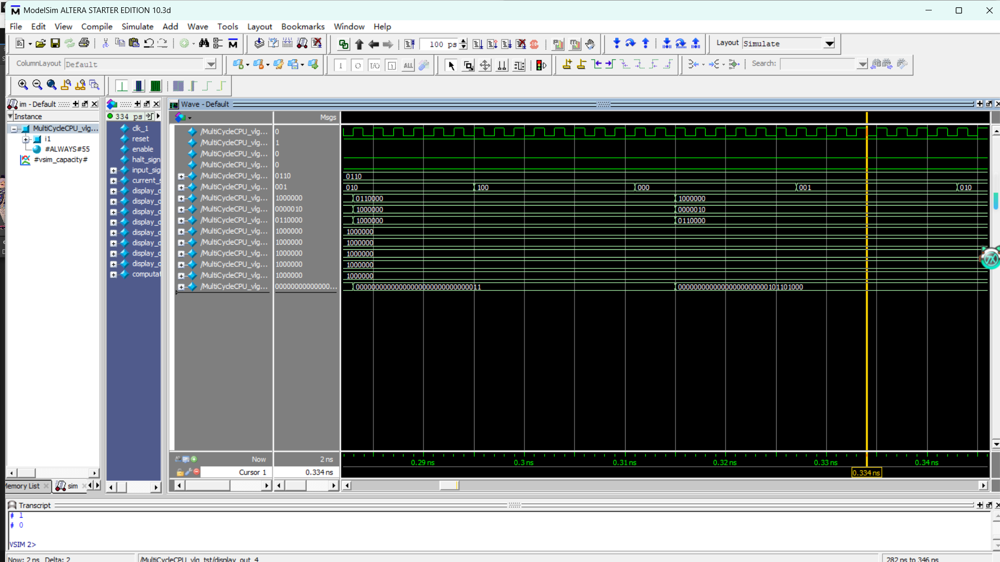

# 项目名称
<div align="center">
<br/>
<br/>
  <h1 align="center">
     MIPS_CPU
  </h1>
  <h4 align="center">
    quartus平台设计单周期/多周期CPU(哈佛架构)
  </h4> 
</div>


**请您点个 Star 多谢！🎉**
## 项目背景

这是大三计算机组成原理课程设计的项目，旨在通过设计一个单/多周期CPU的功能,并呈现出阶乘算法的实现。

####  整个项目结构

```
该项目
├─MultiCycleCPU  # 多周期
│
└─SingleCycleCPU  # 单周期
```

## 如何快速上手这个项目？
- 请参考下方的启动指南:
#### 项目安装
```
git clone https://github.com/Titan-maverick/MIPS_CPU.git
```
或者直接下载zip

##### 打开项目
用quartus打开对应文件夹中后缀为.qpf文件


## 预览项目
以实现6的阶乘为例
### 单周期
<div align="center">
  
</div>
<div align="center">
  
</div>

### 多周期
<div align="center">
  
</div>
<div align="center">
  
</div>
<div align="center">
  
</div>


